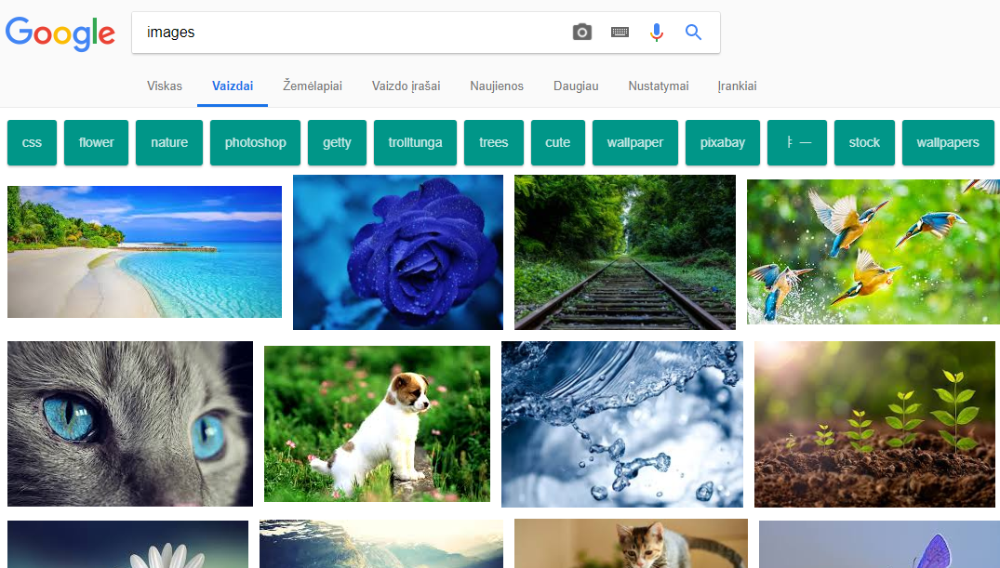
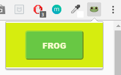
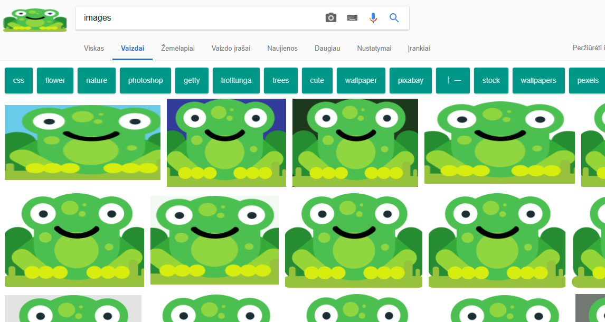

# Image Switcher (chrome extension)

## What are chrome extensions?
Extensions - small software programs that tailor the browsing experience. They enable users to customize Chrome functionality and behavior to individual preferences or needs. They are built using web technologies such as HTML, JavaScript, and CSS.

## What does Image Switcher extension do?
This fun extension replaces all pictures in your tab with a picture of frog. :frog:

### View before:

### Popup:

### View after:

Icon was taken from [here.](https://www.freeiconspng.com/img/10588)

Image was taken from [here.](https://pixabay.com/en/frog-animal-comic-comic-drawing-3241108)
